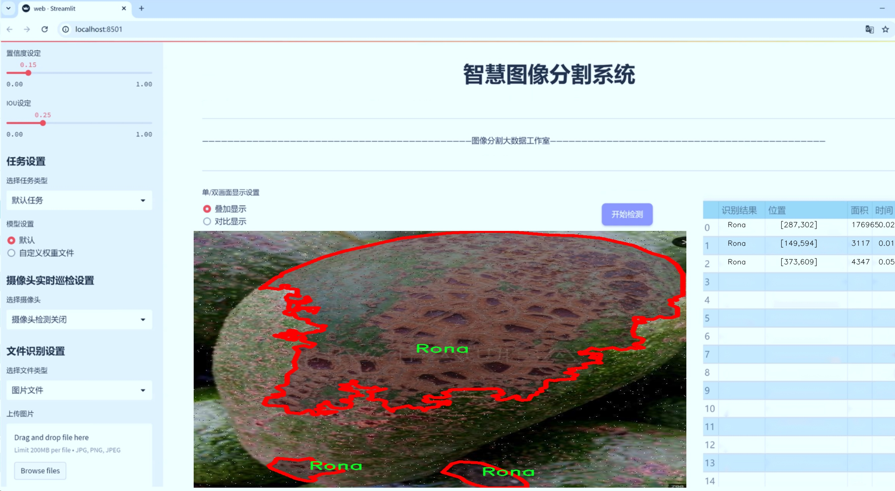
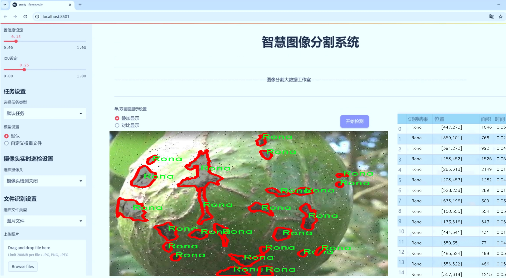
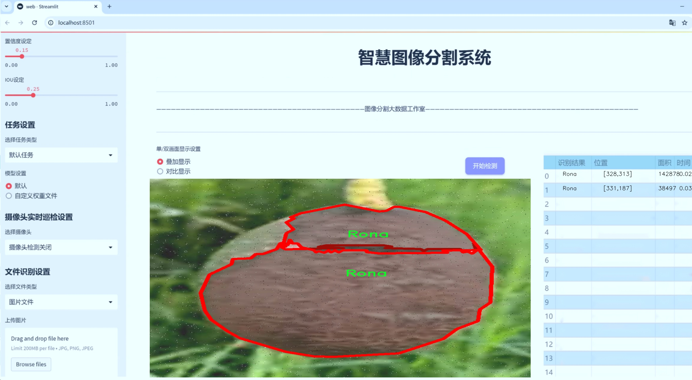
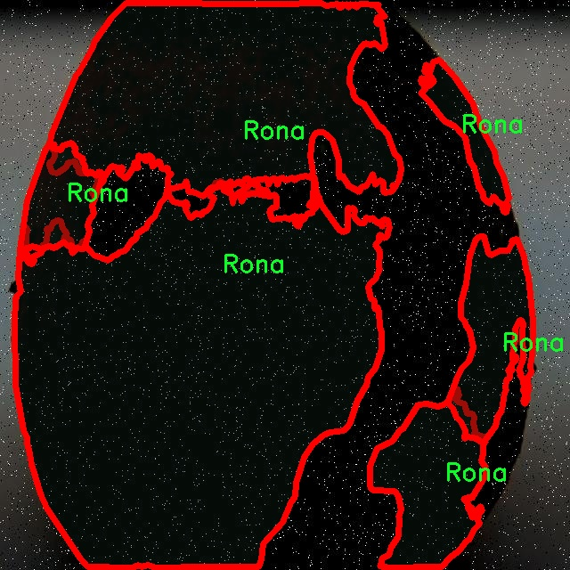
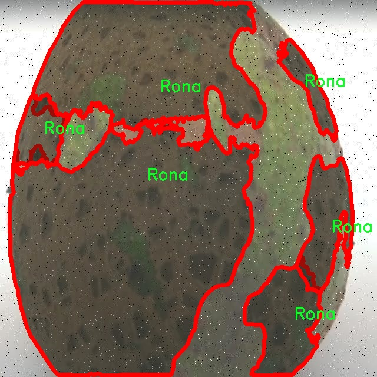
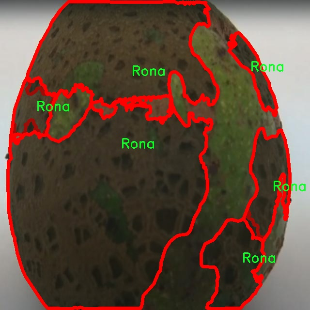
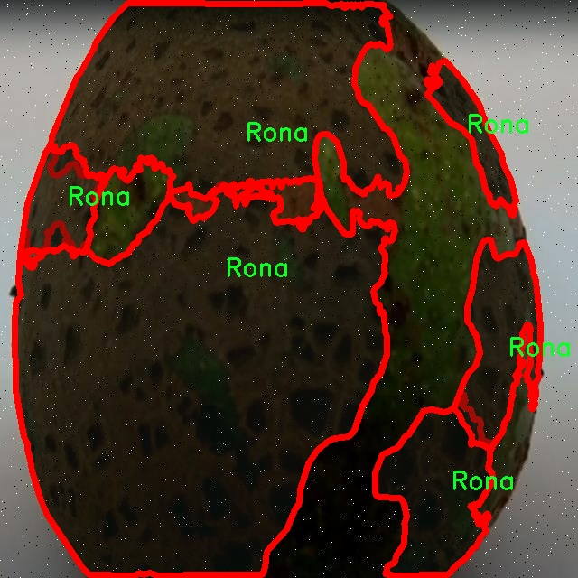
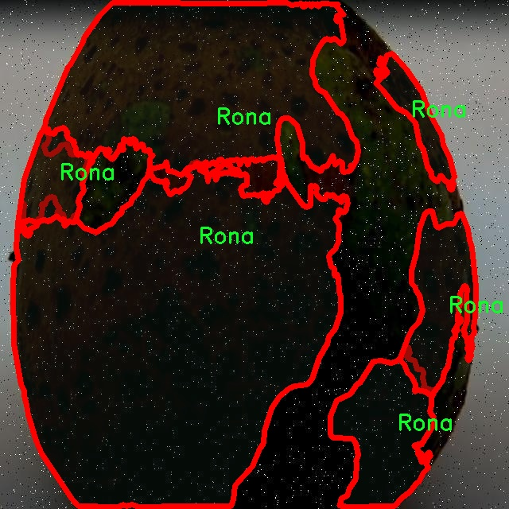

# 鳄梨梨子表面缺陷检测图像分割系统： yolov8-seg-EfficientRepBiPAN

### 1.研究背景与意义

[参考博客](https://gitee.com/YOLOv8_YOLOv11_Segmentation_Studio/projects)

[博客来源](https://kdocs.cn/l/cszuIiCKVNis)

研究背景与意义

随着全球农业生产的现代化进程加快，农产品的质量检测与分级愈发受到重视。尤其是在水果和蔬菜的生产与销售中，表面缺陷的检测不仅影响产品的市场价值，也直接关系到消费者的健康与安全。鳄梨作为一种营养丰富且广受欢迎的水果，其市场需求逐年上升。然而，鳄梨在生长和运输过程中容易受到多种因素的影响，导致表面出现瑕疵，如斑点、划痕和腐烂等，这些缺陷不仅影响其外观，还可能影响其食用安全性。因此，开发一种高效、准确的鳄梨表面缺陷检测系统显得尤为重要。

在此背景下，计算机视觉技术的快速发展为农产品的缺陷检测提供了新的解决方案。YOLO（You Only Look Once）系列模型因其高效的实时目标检测能力而广泛应用于各类图像处理任务。YOLOv8作为该系列的最新版本，进一步提升了检测精度和速度，尤其在复杂背景下的物体识别方面表现出色。然而，传统的YOLOv8模型在处理细粒度的图像分割任务时，仍然存在一定的局限性。因此，基于改进YOLOv8的鳄梨梨子表面缺陷检测图像分割系统的研究具有重要的学术价值和实际意义。

本研究将利用Roboflow平台提供的3700张标注图像数据集，针对鳄梨的表面缺陷进行深入分析。该数据集包含三类缺陷（如Rona），为模型的训练和测试提供了丰富的样本。这些图像的多样性和复杂性为模型的鲁棒性和泛化能力提出了挑战，同时也为研究者提供了宝贵的实验数据。通过对YOLOv8模型的改进，结合实例分割技术，我们旨在提升模型对鳄梨表面缺陷的检测精度，实现对不同类型缺陷的准确识别与分割。

此外，鳄梨的表面缺陷检测不仅具有学术研究的意义，也对实际生产具有重要的应用价值。通过自动化的缺陷检测系统，可以大幅提高检测效率，降低人工成本，减少因人为因素导致的检测误差。这对于提高鳄梨的市场竞争力、保障消费者权益、促进农业可持续发展具有积极的推动作用。

综上所述，基于改进YOLOv8的鳄梨梨子表面缺陷检测图像分割系统的研究，不仅能够推动计算机视觉技术在农业领域的应用，也为相关研究提供了新的思路和方法。通过对这一系统的深入研究，我们希望能够为农产品质量检测提供更为精准和高效的解决方案，助力现代农业的发展与转型。

### 2.图片演示







注意：本项目提供完整的训练源码数据集和训练教程,由于此博客编辑较早,暂不提供权重文件（best.pt）,需要按照6.训练教程进行训练后实现上图效果。

### 3.视频演示

[3.1 视频演示](https://www.bilibili.com/video/BV17QUSYwEAn/)

### 4.数据集信息

##### 4.1 数据集类别数＆类别名

nc: 2
names: ['Rona', 'This dataset was exported via roboflow.com on June 5- 2024 at 9-34 PM GMT']


##### 4.2 数据集信息简介

数据集信息展示

在现代计算机视觉领域，尤其是在物体检测和图像分割任务中，数据集的质量和多样性直接影响到模型的性能和泛化能力。本研究所使用的数据集名为“Avocado”，专门用于训练和改进YOLOv8-seg模型，以实现对鳄梨梨子表面缺陷的高效检测与分割。该数据集的设计旨在为研究人员和开发者提供一个丰富的资源，以便在实际应用中识别和处理鳄梨梨子表面的各种缺陷，从而推动农业生产和质量控制的智能化进程。

“Avocado”数据集包含两个主要类别，分别为“Rona”和“缺陷”。这两个类别涵盖了鳄梨梨子表面可能出现的各种问题，包括但不限于表面裂纹、斑点、腐烂和其他影响果实外观和质量的缺陷。通过对这些缺陷的准确标注和分类，研究人员能够训练出更为精准的模型，以识别和分割不同类型的缺陷，从而为后续的自动化处理提供支持。

数据集的构建过程采用了高标准的图像采集和标注流程，确保了数据的真实性和多样性。图像样本来源于不同的鳄梨梨子种植园，涵盖了多种生长环境和气候条件下的果实。这种多样性不仅增强了数据集的代表性，还提高了模型在不同场景下的适应能力。此外，数据集中的图像均经过专业的标注，确保每个缺陷的边界清晰可见，为YOLOv8-seg模型的训练提供了高质量的输入。

在数据集的使用过程中，研究者可以通过将“Avocado”数据集与YOLOv8-seg模型相结合，进行多种实验和调优。模型的训练过程将涉及到不同的超参数设置和数据增强技术，以提升模型的鲁棒性和准确性。通过对比实验，研究者能够评估模型在不同类别缺陷检测中的表现，进而优化算法和提高检测精度。

值得注意的是，数据集的更新和维护也是确保其长期有效性的关键因素。随着时间的推移，新的鳄梨梨子品种和生长技术的出现，可能会导致缺陷表现的变化。因此，定期更新数据集、增加新的样本和类别，将有助于保持模型的先进性和实用性。

总之，“Avocado”数据集不仅为鳄梨梨子表面缺陷检测提供了丰富的基础数据，还为相关领域的研究提供了广阔的探索空间。通过对该数据集的深入分析和应用，研究人员可以不断推动图像分割技术的发展，提升农业生产的智能化水平，最终实现更高效的果实质量控制和管理。











### 5.项目依赖环境部署教程（零基础手把手教学）

[5.1 环境部署教程链接（零基础手把手教学）](https://www.bilibili.com/video/BV1jG4Ve4E9t/?vd_source=bc9aec86d164b67a7004b996143742dc)


[5.2 安装Python虚拟环境创建和依赖库安装视频教程链接（零基础手把手教学）](https://www.bilibili.com/video/BV1nA4VeYEze/?vd_source=bc9aec86d164b67a7004b996143742dc)

### 6.手把手YOLOV8-seg训练视频教程（零基础手把手教学）

[6.1 手把手YOLOV8-seg训练视频教程（零基础小白有手就能学会）](https://www.bilibili.com/video/BV1cA4VeYETe/?vd_source=bc9aec86d164b67a7004b996143742dc)


按照上面的训练视频教程链接加载项目提供的数据集，运行train.py即可开始训练



     Epoch   gpu_mem       box       obj       cls    labels  img_size
     1/200     0G   0.01576   0.01955  0.007536        22      1280: 100%|██████████| 849/849 [14:42<00:00,  1.04s/it]
               Class     Images     Labels          P          R     mAP@.5 mAP@.5:.95: 100%|██████████| 213/213 [01:14<00:00,  2.87it/s]
                 all       3395      17314      0.994      0.957      0.0957      0.0843

     Epoch   gpu_mem       box       obj       cls    labels  img_size
     2/200     0G   0.01578   0.01923  0.007006        22      1280: 100%|██████████| 849/849 [14:44<00:00,  1.04s/it]
               Class     Images     Labels          P          R     mAP@.5 mAP@.5:.95: 100%|██████████| 213/213 [01:12<00:00,  2.95it/s]
                 all       3395      17314      0.996      0.956      0.0957      0.0845

     Epoch   gpu_mem       box       obj       cls    labels  img_size
     3/200     0G   0.01561    0.0191  0.006895        27      1280: 100%|██████████| 849/849 [10:56<00:00,  1.29it/s]
               Class     Images     Labels          P          R     mAP@.5 mAP@.5:.95: 100%|███████   | 187/213 [00:52<00:00,  4.04it/s]
                 all       3395      17314      0.996      0.957      0.0957      0.0845


### 7.50+种全套YOLOV8-seg创新点加载调参实验视频教程（一键加载写好的改进模型的配置文件）

[7.1 50+种全套YOLOV8-seg创新点加载调参实验视频教程（一键加载写好的改进模型的配置文件）](https://www.bilibili.com/video/BV1Hw4VePEXv/?vd_source=bc9aec86d164b67a7004b996143742dc)

### YOLOV8-seg算法简介

原始YOLOv8-seg算法原理

YOLOv8-seg算法是YOLO系列目标检测模型的最新进展，结合了多种先进的技术和理念，旨在提高目标检测的准确性和效率。该算法在YOLOv5的基础上进行了多项创新，特别是在模型结构、特征提取和损失函数等方面的改进，使其在处理复杂场景和多种目标时表现出色。

首先，YOLOv8-seg的网络结构分为三个主要部分：输入层、主干网络和检测头。输入层负责接收图像数据并进行预处理，确保输入数据的标准化和适应性。主干网络是算法的核心部分，负责提取图像特征。YOLOv8采用了CSPDarknet作为主干网络，但将传统的C3模块替换为C2f模块。C2f模块在设计上借鉴了YOLOv7中的ELAN结构，增加了更多的残差连接，这样不仅提高了梯度流动的效率，还有效地减轻了深层网络中的梯度消失问题。通过这种方式，C2f模块能够更好地保留和重用特征，确保模型在不同层次上都能提取到丰富的信息。

在特征融合方面，YOLOv8采用了PAN-FPN结构，这种结构能够在不同尺度的特征图之间进行有效的融合。通过自下而上的特征融合，YOLOv8能够将高层语义信息与低层细节信息结合起来，从而提高目标检测的精度。具体来说，YOLOv8在上采样阶段删除了冗余的卷积层，直接将高层特征与中层特征进行拼接，形成更加紧凑和高效的特征表示。这种特征融合策略不仅提高了模型的性能，还降低了计算复杂度，使得YOLOv8在实时检测任务中表现得更加出色。

在检测头部分，YOLOv8引入了解耦合头的设计理念，将分类和回归任务分开处理。这种方法使得模型能够更专注于各自的任务，从而提高了分类和定位的精度。此外，YOLOv8采用了Anchor-Free的策略，直接预测目标的中心点，而不再依赖于预定义的锚框。这一创新使得模型在处理不同尺寸和形状的目标时更加灵活，尤其是在复杂背景下，能够有效减少误检和漏检的情况。

在损失函数的设计上，YOLOv8引入了多种损失计算方式，包括BCELoss、DFLLoss和CIoULoss等。BCELoss用于分类任务，DFLLoss和CIoULoss则用于回归任务，这种多样化的损失函数设计使得模型在训练过程中能够更好地平衡分类和定位的损失，从而提高整体性能。此外，YOLOv8还采用了动态样本分配策略，通过Task-Aligned Assigner来优化样本的匹配过程，使得正负样本的比例更加合理，进一步提升了模型的学习效率。

YOLOv8-seg在数据增强方面也进行了创新，特别是在训练的最后阶段，停止使用马赛克增强，以避免对数据分布的干扰。这一策略有助于模型更好地学习真实场景中的特征，增强其泛化能力。此外，YOLOv8还采用了多种数据增强技术，如混合增强、空间扰动和颜色扰动等，进一步提高了模型的鲁棒性。

在实际应用中，YOLOv8-seg展现出了卓越的性能。通过在COCO数据集上的测试，YOLOv8在多个指标上超越了之前的YOLO系列模型，尤其是在mAP（mean Average Precision）方面，表现出色。这使得YOLOv8成为一个非常有前景的目标检测算法，适用于各种实时检测任务，如自动驾驶、安防监控和工业检测等。

总的来说，YOLOv8-seg算法通过对网络结构的创新、特征提取的优化和损失函数的改进，成功地提升了目标检测的性能。其灵活的Anchor-Free设计和高效的特征融合策略，使得YOLOv8在复杂场景下的目标检测能力得到了显著增强。随着YOLOv8的不断发展和完善，未来在目标检测领域的应用前景将更加广阔。


### 9.系统功能展示（检测对象为举例，实际内容以本项目数据集为准）

图9.1.系统支持检测结果表格显示

  图9.2.系统支持置信度和IOU阈值手动调节

  图9.3.系统支持自定义加载权重文件best.pt(需要你通过步骤5中训练获得)

  图9.4.系统支持摄像头实时识别

  图9.5.系统支持图片识别

  图9.6.系统支持视频识别

  图9.7.系统支持识别结果文件自动保存

  图9.8.系统支持Excel导出检测结果数据


### 10.50+种全套YOLOV8-seg创新点原理讲解（非科班也可以轻松写刊发刊，V11版本正在科研待更新）

#### 10.1 由于篇幅限制，每个创新点的具体原理讲解就不一一展开，具体见下列网址中的创新点对应子项目的技术原理博客网址【Blog】：


[10.1 50+种全套YOLOV8-seg创新点原理讲解链接](https://gitee.com/qunmasj/good)

#### 10.2 部分改进模块原理讲解(完整的改进原理见上图和技术博客链接)【如果此小节的图加载失败可以通过CSDN或者Github搜索该博客的标题访问原始博客，原始博客图片显示正常】
### YOLOv8简介
#### Backbone


借鉴了其他算法的这些设计思想

借鉴了VGG的思想，使用了较多的3×3卷积，在每一次池化操作后，将通道数翻倍；

借鉴了network in network的思想，使用全局平均池化（global average pooling）做预测，并把1×1的卷积核置于3×3的卷积核之间，用来压缩特征；（我没找到这一步体现在哪里）

使用了批归一化层稳定模型训练，加速收敛，并且起到正则化作用。

    以上三点为Darknet19借鉴其他模型的点。Darknet53当然是在继承了Darknet19的这些优点的基础上再新增了下面这些优点的。因此列在了这里

借鉴了ResNet的思想，在网络中大量使用了残差连接，因此网络结构可以设计的很深，并且缓解了训练中梯度消失的问题，使得模型更容易收敛。

使用步长为2的卷积层代替池化层实现降采样。（这一点在经典的Darknet-53上是很明显的，output的长和宽从256降到128，再降低到64，一路降低到8，应该是通过步长为2的卷积层实现的；在YOLOv8的卷积层中也有体现，比如图中我标出的这些位置）

#### 特征融合

模型架构图如下

  Darknet-53的特点可以这样概括：（Conv卷积模块+Residual Block残差块）串行叠加4次

  Conv卷积层+Residual Block残差网络就被称为一个stage


上面红色指出的那个，原始的Darknet-53里面有一层 卷积，在YOLOv8里面，把一层卷积移除了

为什么移除呢？

        原始Darknet-53模型中间加的这个卷积层做了什么？滤波器（卷积核）的个数从 上一个卷积层的512个，先增加到1024个卷积核，然后下一层卷积的卷积核的个数又降低到512个

        移除掉这一层以后，少了1024个卷积核，就可以少做1024次卷积运算，同时也少了1024个3×3的卷积核的参数，也就是少了9×1024个参数需要拟合。这样可以大大减少了模型的参数，（相当于做了轻量化吧）

        移除掉这个卷积层，可能是因为作者发现移除掉这个卷积层以后，模型的score有所提升，所以才移除掉的。为什么移除掉以后，分数有所提高呢？可能是因为多了这些参数就容易，参数过多导致模型在训练集删过拟合，但是在测试集上表现很差，最终模型的分数比较低。你移除掉这个卷积层以后，参数减少了，过拟合现象不那么严重了，泛化能力增强了。当然这个是，拿着你做实验的结论，反过来再找补，再去强行解释这种现象的合理性。

过拟合


通过MMdetection官方绘制册这个图我们可以看到，进来的这张图片经过一个“Feature Pyramid Network(简称FPN)”，然后最后的P3、P4、P5传递给下一层的Neck和Head去做识别任务。 PAN（Path Aggregation Network）


“FPN是自顶向下，将高层的强语义特征传递下来。PAN就是在FPN的后面添加一个自底向上的金字塔，对FPN补充，将低层的强定位特征传递上去，

FPN是自顶（小尺寸，卷积次数多得到的结果，语义信息丰富）向下（大尺寸，卷积次数少得到的结果），将高层的强语义特征传递下来，对整个金字塔进行增强，不过只增强了语义信息，对定位信息没有传递。PAN就是针对这一点，在FPN的后面添加一个自底（卷积次数少，大尺寸）向上（卷积次数多，小尺寸，语义信息丰富）的金字塔，对FPN补充，将低层的强定位特征传递上去，又被称之为“双塔战术”。

FPN层自顶向下传达强语义特征，而特征金字塔则自底向上传达强定位特征，两两联手，从不同的主干层对不同的检测层进行参数聚合,这样的操作确实很皮。
#### 自底向上增强

而 PAN（Path Aggregation Network）是对 FPN 的一种改进，它的设计理念是在 FPN 后面添加一个自底向上的金字塔。PAN 引入了路径聚合的方式，通过将浅层特征图（低分辨率但语义信息较弱）和深层特征图（高分辨率但语义信息丰富）进行聚合，并沿着特定的路径传递特征信息，将低层的强定位特征传递上去。这样的操作能够进一步增强多尺度特征的表达能力，使得 PAN 在目标检测任务中表现更加优秀。


### 可重参化EfficientRepBiPAN优化Neck
#### Repvgg-style
Repvgg-style的卷积层包含
卷积+ReLU结构，该结构能够有效地利用硬件资源。

在训练时，Repvgg-style的卷积层包含
卷积、
卷积、identity。（下图左图）


在推理时，通过重参数化（re-parameterization），上述的多分支结构可以转换为单分支的
卷积。（下图右图）


基于上述思想，作者设计了对GPU硬件友好的EfficientRep Backbone和Rep-PAN Neck，将它们用于YOLOv6中。

EfficientRep Backbone的结构图：


Rep-PAN Neck结构图：


#### Multi-path
只使用repvgg-style不能达到很好的精度-速度平衡，对于大模型，作者探索了多路径的网络结构。

参考该博客提出了Bep unit，其结构如下图所示：


CSP（Cross Stage Partial）-style计算量小，且有丰富的梯度融合信息，广泛应用于YOLO系列中，比如YOLOv5、PPYOLOE。

作者将Bep unit与CSP-style结合，设计了一种新的网络结构BepC3，如下图所示：


基于BepC3模块，作者设计了新的CSPBep Backbone和CSPRepPAN Neck，以达到很好的精度-速度平衡。

其他YOLO系列在使用CSP-stype结构时，partial ratio设置为1/2。为了达到更好的性能，在YOLOv6m中partial ratio的值为2/3，在YOLOv6l中partial ratio的值为1/2。

对于YOLOv6m，单纯使用Rep-style结构和使用BepC3结构的对比如下图所示：

#### BIFPN
BiFPN 全称 Bidirectional Feature Pyramid Network 加权双向（自顶向下 + 自低向上）特征金字塔网络。

相比较于PANet，BiFPN在设计上的改变：

总结下图：
图d 蓝色部分为自顶向下的通路，传递的是高层特征的语义信息；红色部分是自底向上的通路，传递的是低层特征的位置信息；紫色部分是上述第二点提到的同一层在输入节点和输入节点间新加的一条边。


我们删除那些只有一条输入边的节点。这么做的思路很简单：如果一个节点只有一条输入边而没有特征融合，那么它对旨在融合不同特征的特征网络的贡献就会很小。删除它对我们的网络影响不大，同时简化了双向网络；如上图d 的 P7右边第一个节点

如果原始输入节点和输出节点处于同一层，我们会在原始输入节点和输出节点之间添加一条额外的边。思路：以在不增加太多成本的情况下融合更多的特性；

与只有一个自顶向下和一个自底向上路径的PANet不同，我们处理每个双向路径(自顶向下和自底而上)路径作为一个特征网络层，并重复同一层多次，以实现更高层次的特征融合。如下图EfficientNet 的网络结构所示，我们对BiFPN是重复使用多次的。而这个使用次数也不是我们认为设定的，而是作为参数一起加入网络的设计当中，使用NAS技术算出来的。


Weighted Feature Fusion 带权特征融合：学习不同输入特征的重要性，对不同输入特征有区分的融合。
设计思路：传统的特征融合往往只是简单的 feature map 叠加/相加 (sum them up)，比如使用concat或者shortcut连接，而不对同时加进来的 feature map 进行区分。然而，不同的输入 feature map 具有不同的分辨率，它们对融合输入 feature map 的贡献也是不同的，因此简单的对他们进行相加或叠加处理并不是最佳的操作。所以这里我们提出了一种简单而高效的加权特融合的机制。
常见的带权特征融合有三种方法，分别是：


​
  这种方法比较简单，直接加一个可学习的权重。但是由于这个权重不受限制，所有可能引起训练的不稳定，所有并不推荐。
Softmax-based fusion: O = ∑ i e w i ∗ I i ϵ + ∑ j e w j O = \sum_{i} \frac{e^{w_i} * I_i}{ \epsilon+\sum_{j}e^{w_j}}O=∑ 

 

​
  使用这种方法可以将范围放缩到 [ 0 , 1 ] [0, 1][0,1] 之间，训练稳定，但是训练很慢，所有也不推荐。
Fast normalized fusion: O = ∑ i w i ∗ I i ϵ + ∑ j w j O = \sum_{i} \frac{w_i * I_i}{ \epsilon+\sum_{j}w_j}O=∑ 


### 11.项目核心源码讲解（再也不用担心看不懂代码逻辑）

#### 11.1 ultralytics\utils\instance.py

以下是经过简化和注释的核心代码，保留了 `Bboxes` 和 `Instances` 类的核心功能和方法。注释详细解释了每个部分的作用和功能。

```python
import numpy as np

# 定义支持的边界框格式
_formats = ['xyxy', 'xywh', 'ltwh']

class Bboxes:
    """
    处理边界框的类，支持多种格式。
    """

    def __init__(self, bboxes, format='xyxy') -> None:
        """初始化 Bboxes 类，设置边界框数据和格式。"""
        assert format in _formats, f'无效的边界框格式: {format}, 必须是 {_formats} 中的一种'
        bboxes = bboxes[None, :] if bboxes.ndim == 1 else bboxes  # 如果是一维数组，转为二维
        assert bboxes.ndim == 2 and bboxes.shape[1] == 4  # 确保是二维数组且每个框有4个坐标
        self.bboxes = bboxes
        self.format = format

    def convert(self, format):
        """转换边界框格式。"""
        assert format in _formats, f'无效的边界框格式: {format}, 必须是 {_formats} 中的一种'
        if self.format == format:
            return
        # 根据当前格式和目标格式选择转换函数
        func = self._get_conversion_function(format)
        self.bboxes = func(self.bboxes)  # 执行转换
        self.format = format

    def _get_conversion_function(self, format):
        """根据当前格式和目标格式返回相应的转换函数。"""
        if self.format == 'xyxy':
            return xyxy2xywh if format == 'xywh' else xyxy2ltwh
        elif self.format == 'xywh':
            return xywh2xyxy if format == 'xyxy' else xywh2ltwh
        else:
            return ltwh2xyxy if format == 'xyxy' else ltwh2xywh

    def areas(self):
        """计算每个边界框的面积。"""
        self.convert('xyxy')  # 转换为 xyxy 格式以计算面积
        return (self.bboxes[:, 2] - self.bboxes[:, 0]) * (self.bboxes[:, 3] - self.bboxes[:, 1])  # 宽 * 高

    def __len__(self):
        """返回边界框的数量。"""
        return len(self.bboxes)

class Instances:
    """
    存储图像中检测到的对象的边界框、分段和关键点的容器。
    """

    def __init__(self, bboxes, segments=None, keypoints=None, bbox_format='xywh', normalized=True) -> None:
        """初始化 Instances 类，设置边界框、分段和关键点。"""
        self._bboxes = Bboxes(bboxes=bboxes, format=bbox_format)  # 初始化边界框
        self.keypoints = keypoints
        self.normalized = normalized
        self.segments = self._process_segments(segments)  # 处理分段数据

    def _process_segments(self, segments):
        """处理分段数据，确保其形状正确。"""
        if segments is None:
            return np.zeros((0, 1000, 2), dtype=np.float32)  # 如果没有分段，返回空数组
        segments = resample_segments(segments)  # 对分段进行重采样
        return np.stack(segments, axis=0)  # 堆叠成三维数组

    def convert_bbox(self, format):
        """转换边界框格式。"""
        self._bboxes.convert(format=format)

    @property
    def bbox_areas(self):
        """计算边界框的面积。"""
        return self._bboxes.areas()

    def __getitem__(self, index) -> 'Instances':
        """
        使用索引获取特定实例或一组实例。
        """
        segments = self.segments[index] if len(self.segments) else self.segments
        keypoints = self.keypoints[index] if self.keypoints is not None else None
        bboxes = self._bboxes[index]
        bbox_format = self._bboxes.format
        return Instances(bboxes=bboxes, segments=segments, keypoints=keypoints, bbox_format=bbox_format, normalized=self.normalized)

    def __len__(self):
        """返回实例的数量。"""
        return len(self._bboxes)

    @classmethod
    def concatenate(cls, instances_list: List['Instances'], axis=0) -> 'Instances':
        """
        将多个 Instances 对象连接成一个新的 Instances 对象。
        """
        assert isinstance(instances_list, (list, tuple))
        if not instances_list:
            return cls(np.empty(0))
        assert all(isinstance(instance, Instances) for instance in instances_list)

        # 连接边界框、分段和关键点
        cat_boxes = np.concatenate([ins.bboxes for ins in instances_list], axis=axis)
        cat_segments = np.concatenate([b.segments for b in instances_list], axis=axis)
        cat_keypoints = np.concatenate([b.keypoints for b in instances_list], axis=axis) if instances_list[0].keypoints is not None else None
        return cls(cat_boxes, cat_segments, cat_keypoints, instances_list[0]._bboxes.format, instances_list[0].normalized)

    @property
    def bboxes(self):
        """返回边界框。"""
        return self._bboxes.bboxes
```

### 代码核心部分说明：
1. **Bboxes 类**：用于处理边界框的创建、格式转换和面积计算。支持三种格式（`xyxy`, `xywh`, `ltwh`）。
2. **Instances 类**：用于存储和管理图像中检测到的对象的边界框、分段和关键点。提供了格式转换、索引访问和连接多个实例的功能。
3. **方法和属性**：包括初始化、格式转换、面积计算、索引访问等，确保用户可以方便地操作和获取边界框信息。

这段代码的核心功能在于提供一个灵活的接口来处理和转换边界框数据，适用于计算机视觉任务中的目标检测。

这个文件是一个用于处理边界框（bounding boxes）的Python模块，主要用于计算机视觉任务，特别是在目标检测中。它定义了两个主要的类：`Bboxes`和`Instances`，分别用于管理边界框和图像中检测到的对象的实例。

首先，`Bboxes`类负责处理边界框的创建、转换和计算。它支持三种边界框格式：`xyxy`（左上角和右下角坐标）、`xywh`（中心坐标和宽高）以及`ltwh`（左上角坐标和宽高）。在初始化时，`Bboxes`类会检查输入的格式是否有效，并确保输入的边界框数据是一个二维的NumPy数组，形状为[N, 4]，其中N是边界框的数量。

`Bboxes`类提供了多种方法，包括：
- `convert(format)`：将边界框从一种格式转换为另一种格式。
- `areas()`：计算每个边界框的面积。
- `mul(scale)`和`add(offset)`：分别用于缩放和偏移边界框的坐标。
- `__len__()`：返回边界框的数量。
- `concatenate(boxes_list)`：将多个`Bboxes`对象合并为一个新的`Bboxes`对象。
- `__getitem__(index)`：支持通过索引获取特定的边界框。

接下来，`Instances`类是一个更复杂的容器，用于存储图像中检测到的对象的边界框、分段（segments）和关键点（keypoints）。它在初始化时接受边界框、分段和关键点的数据，并可以处理这些数据的缩放和归一化。`Instances`类也提供了方法来转换边界框格式、计算边界框面积、进行坐标的翻转、裁剪和去除零面积的边界框等。

`Instances`类的主要功能包括：
- `convert_bbox(format)`：转换边界框格式。
- `scale(scale_w, scale_h, bbox_only=False)`：按给定的宽度和高度缩放边界框、分段和关键点。
- `denormalize(w, h)`和`normalize(w, h)`：分别用于将坐标从归一化状态转换为绝对坐标，或反之。
- `add_padding(padw, padh)`：在边界框和分段中添加填充。
- `__getitem__(index)`：支持通过索引获取特定的实例。
- `clip(w, h)`：将边界框、分段和关键点的坐标限制在图像边界内。
- `remove_zero_area_boxes()`：移除面积为零的边界框。
- `update(bboxes, segments=None, keypoints=None)`：更新实例的边界框、分段和关键点数据。
- `concatenate(instances_list)`：将多个`Instances`对象合并为一个新的`Instances`对象。

总的来说，这个模块提供了一套完整的工具，用于处理和操作边界框数据，适用于目标检测和相关的计算机视觉任务。通过这些类和方法，用户可以方便地管理边界框及其相关信息，进行各种变换和计算。

#### 11.2 ultralytics\utils\ops.py

以下是经过简化并添加详细中文注释的核心代码部分：

```python
import torch
import torchvision

def non_max_suppression(
        prediction,
        conf_thres=0.25,
        iou_thres=0.45,
        classes=None,
        agnostic=False,
        multi_label=False,
        labels=(),
        max_det=300,
        nc=0,  # 类别数量（可选）
        max_time_img=0.05,
        max_nms=30000,
        max_wh=7680,
):
    """
    对一组边界框执行非最大抑制（NMS），支持掩码和每个框多个标签。

    Args:
        prediction (torch.Tensor): 预测结果的张量，形状为 (batch_size, num_classes + 4 + num_masks, num_boxes)
        conf_thres (float): 置信度阈值，低于该值的框将被过滤。
        iou_thres (float): IoU阈值，低于该值的框将在NMS过程中被过滤。
        classes (List[int]): 要考虑的类别索引列表。如果为None，则考虑所有类别。
        agnostic (bool): 如果为True，模型对类别数量不敏感，所有类别视为一个。
        multi_label (bool): 如果为True，每个框可能有多个标签。
        labels (List[List[Union[int, float, torch.Tensor]]]): 每个图像的先验标签列表。
        max_det (int): NMS后要保留的最大框数量。
        nc (int, optional): 模型输出的类别数量。
        max_time_img (float): 处理一张图像的最大时间（秒）。
        max_nms (int): 传递给torchvision.ops.nms()的最大框数量。
        max_wh (int): 最大框宽度和高度（像素）。

    Returns:
        (List[torch.Tensor]): 长度为batch_size的列表，每个元素是形状为(num_boxes, 6 + num_masks)的张量。
    """
    
    # 检查置信度和IoU阈值是否有效
    assert 0 <= conf_thres <= 1, f'无效的置信度阈值 {conf_thres}, 有效值在0.0到1.0之间'
    assert 0 <= iou_thres <= 1, f'无效的IoU {iou_thres}, 有效值在0.0到1.0之间'
    
    # 处理模型输出
    if isinstance(prediction, (list, tuple)):  # 如果是YOLOv8模型的验证输出
        prediction = prediction[0]  # 选择推理输出

    device = prediction.device  # 获取设备信息
    bs = prediction.shape[0]  # 批量大小
    nc = nc or (prediction.shape[1] - 4)  # 获取类别数量
    nm = prediction.shape[1] - nc - 4  # 掩码数量
    mi = 4 + nc  # 掩码起始索引
    xc = prediction[:, 4:mi].amax(1) > conf_thres  # 筛选候选框

    # 转置预测结果
    prediction = prediction.transpose(-1, -2)  # 形状从(1,84,6300)变为(1,6300,84)
    prediction[..., :4] = xywh2xyxy(prediction[..., :4])  # 将xywh格式转换为xyxy格式

    output = [torch.zeros((0, 6 + nm), device=prediction.device)] * bs  # 初始化输出
    for xi, x in enumerate(prediction):  # 遍历每张图像的预测结果
        x = x[xc[xi]]  # 过滤掉置信度低的框

        # 如果没有剩余框，处理下一张图像
        if not x.shape[0]:
            continue

        # 分离边界框、类别和掩码
        box, cls, mask = x.split((4, nc, nm), 1)

        # 处理多标签情况
        if multi_label:
            i, j = torch.where(cls > conf_thres)  # 找到置信度高的标签
            x = torch.cat((box[i], x[i, 4 + j, None], j[:, None].float(), mask[i]), 1)
        else:  # 只保留最佳类别
            conf, j = cls.max(1, keepdim=True)
            x = torch.cat((box, conf, j.float(), mask), 1)[conf.view(-1) > conf_thres]

        # 根据类别过滤框
        if classes is not None:
            x = x[(x[:, 5:6] == torch.tensor(classes, device=x.device)).any(1)]

        n = x.shape[0]  # 当前框的数量
        if not n:  # 如果没有框
            continue
        if n > max_nms:  # 如果框的数量超过最大限制
            x = x[x[:, 4].argsort(descending=True)[:max_nms]]  # 按置信度排序并去除多余框

        # 执行NMS
        boxes, scores = x[:, :4], x[:, 4]  # 提取框和置信度
        i = torchvision.ops.nms(boxes, scores, iou_thres)  # 进行NMS
        i = i[:max_det]  # 限制检测数量

        output[xi] = x[i]  # 保存结果

    return output  # 返回处理后的结果
```

### 代码核心部分解释：
1. **非最大抑制（NMS）**：该函数的主要功能是对预测的边界框进行过滤，保留置信度高且重叠度低的框，以减少冗余检测。
2. **参数说明**：函数接受多个参数，包括置信度阈值、IoU阈值、类别过滤等，以便于灵活控制检测结果。
3. **处理过程**：
   - 首先检查输入的有效性。
   - 对模型的输出进行处理，提取出边界框、类别和掩码信息。
   - 根据置信度和类别进行筛选，执行NMS，最终返回保留的边界框。

通过这些注释，代码的功能和逻辑变得更加清晰。

这个程序文件 `ultralytics/utils/ops.py` 是一个用于处理图像和目标检测的工具库，主要与 YOLO（You Only Look Once）模型相关。文件中包含多个函数和一个类，提供了各种操作，如时间记录、坐标转换、非极大值抑制、边界框缩放等功能。

首先，文件定义了一个 `Profile` 类，用于测量代码块的执行时间。这个类可以作为装饰器或上下文管理器使用，能够记录执行时间并返回一个可读的字符串表示。它使用 `torch.cuda.synchronize()` 来确保在使用 GPU 时的时间测量准确。

接下来，文件中有多个函数实现了不同的功能。`segment2box` 函数将分割标签转换为边界框标签，确保框的坐标在图像内部。`scale_boxes` 函数则用于根据图像的形状调整边界框的大小，支持图像的填充和缩放。

`make_divisible` 函数返回一个最接近的可被指定除数整除的数字，常用于网络结构中以确保某些层的输出尺寸符合要求。`non_max_suppression` 函数实现了非极大值抑制算法，用于从多个重叠的边界框中筛选出最优的框，支持多标签和类别过滤。

此外，文件中还有多个坐标转换函数，如 `xyxy2xywh` 和 `xywh2xyxy`，用于在不同的边界框表示格式之间进行转换。这些函数可以将边界框的坐标从左上角和右下角的表示转换为中心点和宽高的表示，反之亦然。

文件还包含了处理掩膜的函数，如 `process_mask` 和 `crop_mask`，这些函数用于根据边界框裁剪和调整掩膜的大小，以便于后续的处理和分析。

最后，文件中还定义了一些实用的辅助函数，如 `clean_str` 用于清理字符串，`convert_torch2numpy_batch` 用于将 PyTorch 张量转换为 NumPy 数组，方便在不同的框架之间进行数据交换。

总体来说，这个文件是 YOLO 模型实现中的一个重要组成部分，提供了许多基础的图像处理和目标检测相关的功能，方便用户在进行目标检测任务时进行各种操作。

#### 11.3 ultralytics\nn\backbone\efficientViT.py

以下是代码中最核心的部分，并附上详细的中文注释：

```python
import torch
import torch.nn as nn
import torch.nn.functional as F
import itertools

class Conv2d_BN(torch.nn.Sequential):
    """带有BatchNorm的卷积层"""
    def __init__(self, in_channels, out_channels, kernel_size=1, stride=1, padding=0, dilation=1,
                 groups=1, bn_weight_init=1):
        super().__init__()
        # 添加卷积层
        self.add_module('c', torch.nn.Conv2d(
            in_channels, out_channels, kernel_size, stride, padding, dilation, groups, bias=False))
        # 添加BatchNorm层
        self.add_module('bn', torch.nn.BatchNorm2d(out_channels))
        # 初始化BatchNorm的权重和偏置
        torch.nn.init.constant_(self.bn.weight, bn_weight_init)
        torch.nn.init.constant_(self.bn.bias, 0)

    @torch.no_grad()
    def switch_to_deploy(self):
        """将训练模式转换为推理模式，合并卷积和BatchNorm"""
        c, bn = self._modules.values()
        w = bn.weight / (bn.running_var + bn.eps)**0.5  # 计算卷积权重
        w = c.weight * w[:, None, None, None]  # 进行权重缩放
        b = bn.bias - bn.running_mean * bn.weight / (bn.running_var + bn.eps)**0.5  # 计算偏置
        # 创建新的卷积层并复制权重和偏置
        m = torch.nn.Conv2d(w.size(1) * self.c.groups, w.size(0), w.shape[2:], stride=self.c.stride, padding=self.c.padding, dilation=self.c.dilation, groups=self.c.groups)
        m.weight.data.copy_(w)
        m.bias.data.copy_(b)
        return m

class EfficientViTBlock(torch.nn.Module):
    """EfficientViT的基本构建块"""
    def __init__(self, ed, kd, nh=8, ar=4, resolution=14, window_resolution=7):
        super().__init__()
        # 残差卷积层
        self.dw0 = Residual(Conv2d_BN(ed, ed, 3, 1, 1, groups=ed, bn_weight_init=0.))
        # 前馈网络
        self.ffn0 = Residual(FFN(ed, int(ed * 2)))

        # 局部窗口注意力机制
        self.mixer = Residual(LocalWindowAttention(ed, kd, nh, attn_ratio=ar, resolution=resolution, window_resolution=window_resolution))

        # 另一个残差卷积层和前馈网络
        self.dw1 = Residual(Conv2d_BN(ed, ed, 3, 1, 1, groups=ed, bn_weight_init=0.))
        self.ffn1 = Residual(FFN(ed, int(ed * 2)))

    def forward(self, x):
        """前向传播"""
        return self.ffn1(self.dw1(self.mixer(self.ffn0(self.dw0(x)))))

class EfficientViT(torch.nn.Module):
    """EfficientViT模型"""
    def __init__(self, img_size=400, patch_size=16, in_chans=3, embed_dim=[64, 128, 192], depth=[1, 2, 3], num_heads=[4, 4, 4], window_size=[7, 7, 7]):
        super().__init__()
        # 图像嵌入层
        self.patch_embed = torch.nn.Sequential(
            Conv2d_BN(in_chans, embed_dim[0] // 8, 3, 2, 1),
            torch.nn.ReLU(),
            Conv2d_BN(embed_dim[0] // 8, embed_dim[0] // 4, 3, 2, 1),
            torch.nn.ReLU(),
            Conv2d_BN(embed_dim[0] // 4, embed_dim[0] // 2, 3, 2, 1),
            torch.nn.ReLU(),
            Conv2d_BN(embed_dim[0] // 2, embed_dim[0], 3, 1, 1)
        )

        # 创建多个EfficientViT块
        self.blocks = []
        for i in range(len(depth)):
            for _ in range(depth[i]):
                self.blocks.append(EfficientViTBlock(embed_dim[i], embed_dim[i] // 4, num_heads[i], resolution=img_size // patch_size))

        self.blocks = torch.nn.Sequential(*self.blocks)

    def forward(self, x):
        """前向传播"""
        x = self.patch_embed(x)  # 图像嵌入
        x = self.blocks(x)  # 通过EfficientViT块
        return x

# 实例化模型
if __name__ == '__main__':
    model = EfficientViT(img_size=224, patch_size=16)
    inputs = torch.randn((1, 3, 640, 640))  # 随机输入
    res = model(inputs)  # 前向传播
    print(res.size())  # 输出结果的尺寸
```

### 代码核心部分说明：
1. **Conv2d_BN**: 这是一个带有Batch Normalization的卷积层，能够在训练过程中提高模型的稳定性和收敛速度。
2. **EfficientViTBlock**: 这是EfficientViT的基本构建块，包含卷积层、前馈网络和局部窗口注意力机制，形成了一个完整的模块。
3. **EfficientViT**: 这是整个模型的实现，负责将输入图像嵌入到特征空间，并通过多个EfficientViT块进行处理。
4. **前向传播**: 在`forward`方法中，输入经过图像嵌入层和多个EfficientViT块，最终输出特征图。

通过这些核心部分的组合，EfficientViT模型能够有效地处理图像数据，适用于各种下游任务。

这个程序文件定义了一个名为 `EfficientViT` 的模型架构，主要用于计算机视觉的下游任务。该模型是基于视觉变换器（Vision Transformer）设计的，旨在提高效率和性能。文件中包含多个类和函数，下面是对其主要部分的逐步说明。

首先，文件导入了必要的库，包括 PyTorch 和一些自定义的模块。接着，定义了一个 `Conv2d_BN` 类，它是一个包含卷积层和批归一化层的顺序容器。该类的构造函数允许用户设置卷积的参数，并对批归一化的权重进行初始化。`switch_to_deploy` 方法用于在推理阶段将卷积和批归一化融合，以提高推理速度。

接下来，`replace_batchnorm` 函数用于遍历网络的子模块，将所有的批归一化层替换为恒等映射，从而减少计算开销。

`PatchMerging` 类实现了一个用于合并图像块的模块，它通过多个卷积层和激活函数来处理输入特征图，并应用了 Squeeze-and-Excitation（SE）机制以增强特征表示。

`Residual` 类实现了残差连接，允许在训练期间随机丢弃一些输入，以提高模型的鲁棒性。

`FFN` 类实现了前馈神经网络，由两个卷积层和一个激活函数组成，用于特征的进一步处理。

`CascadedGroupAttention` 和 `LocalWindowAttention` 类实现了不同类型的注意力机制，前者使用级联的组注意力，而后者则使用局部窗口注意力。这些注意力机制能够在特征图上自适应地聚焦重要信息，从而提升模型的表现。

`EfficientViTBlock` 类是构建 `EfficientViT` 模型的基本单元，它结合了卷积、前馈网络和注意力机制，形成一个完整的处理模块。

`EfficientViT` 类是整个模型的核心，构造函数中定义了多个阶段的特征提取模块，包括图像块嵌入、多个 `EfficientViTBlock` 的堆叠以及下采样操作。模型的前向传播方法依次通过这些模块处理输入数据，并返回多个阶段的输出特征。

在文件的最后，定义了一些模型配置（如 `EfficientViT_m0` 到 `EfficientViT_m5`），这些配置指定了不同模型的参数设置。随后，提供了一系列函数（如 `EfficientViT_M0` 等）用于创建特定配置的模型，并支持加载预训练权重和批归一化替换。

最后，程序的主入口部分创建了一个 `EfficientViT_M0` 模型实例，并通过随机生成的输入数据测试模型的前向传播，输出各个阶段的特征图尺寸。

总体而言，这个文件实现了一个高效的视觉变换器模型，适用于各种计算机视觉任务，具有良好的灵活性和可扩展性。

#### 11.4 ultralytics\utils\triton.py

以下是代码中最核心的部分，并附上详细的中文注释：

```python
import numpy as np
from urllib.parse import urlsplit

class TritonRemoteModel:
    """
    与远程Triton推理服务器模型交互的客户端。

    属性:
        endpoint (str): Triton服务器上模型的名称。
        url (str): Triton服务器的URL。
        triton_client: Triton客户端（HTTP或gRPC）。
        InferInput: Triton客户端的输入类。
        InferRequestedOutput: Triton客户端的输出请求类。
        input_formats (List[str]): 模型输入的数据类型。
        np_input_formats (List[type]): 模型输入的numpy数据类型。
        input_names (List[str]): 模型输入的名称。
        output_names (List[str]): 模型输出的名称。
    """

    def __init__(self, url: str, endpoint: str = '', scheme: str = ''):
        """
        初始化TritonRemoteModel。

        参数可以单独提供，也可以从形式为<scheme>://<netloc>/<endpoint>/<task_name>的URL参数中解析。

        参数:
            url (str): Triton服务器的URL。
            endpoint (str): Triton服务器上模型的名称。
            scheme (str): 通信方案（'http'或'gRPC'）。
        """
        # 如果没有提供endpoint和scheme，则从URL中解析
        if not endpoint and not scheme:
            splits = urlsplit(url)  # 解析URL
            endpoint = splits.path.strip('/').split('/')[0]  # 获取模型名称
            scheme = splits.scheme  # 获取通信方案
            url = splits.netloc  # 获取服务器地址

        self.endpoint = endpoint  # 设置模型名称
        self.url = url  # 设置服务器URL

        # 根据通信方案选择Triton客户端
        if scheme == 'http':
            import tritonclient.http as client  # 导入HTTP客户端
            self.triton_client = client.InferenceServerClient(url=self.url, verbose=False, ssl=False)
            config = self.triton_client.get_model_config(endpoint)  # 获取模型配置
        else:
            import tritonclient.grpc as client  # 导入gRPC客户端
            self.triton_client = client.InferenceServerClient(url=self.url, verbose=False, ssl=False)
            config = self.triton_client.get_model_config(endpoint, as_json=True)['config']  # 获取模型配置

        # 按字母顺序排序输出名称
        config['output'] = sorted(config['output'], key=lambda x: x.get('name'))

        # 定义模型属性
        type_map = {'TYPE_FP32': np.float32, 'TYPE_FP16': np.float16, 'TYPE_UINT8': np.uint8}
        self.InferRequestedOutput = client.InferRequestedOutput  # 设置输出请求类
        self.InferInput = client.InferInput  # 设置输入类
        self.input_formats = [x['data_type'] for x in config['input']]  # 获取输入数据类型
        self.np_input_formats = [type_map[x] for x in self.input_formats]  # 转换为numpy数据类型
        self.input_names = [x['name'] for x in config['input']]  # 获取输入名称
        self.output_names = [x['name'] for x in config['output']]  # 获取输出名称

    def __call__(self, *inputs: np.ndarray) -> List[np.ndarray]:
        """
        使用给定的输入调用模型。

        参数:
            *inputs (List[np.ndarray]): 输入数据。

        返回:
            List[np.ndarray]: 模型输出。
        """
        infer_inputs = []  # 存储推理输入
        input_format = inputs[0].dtype  # 获取输入数据类型
        for i, x in enumerate(inputs):
            # 如果输入数据类型与模型要求不匹配，则转换数据类型
            if x.dtype != self.np_input_formats[i]:
                x = x.astype(self.np_input_formats[i])
            # 创建InferInput对象并设置数据
            infer_input = self.InferInput(self.input_names[i], [*x.shape], self.input_formats[i].replace('TYPE_', ''))
            infer_input.set_data_from_numpy(x)  # 从numpy数组设置数据
            infer_inputs.append(infer_input)  # 添加到推理输入列表

        # 创建输出请求
        infer_outputs = [self.InferRequestedOutput(output_name) for output_name in self.output_names]
        # 调用Triton客户端进行推理
        outputs = self.triton_client.infer(model_name=self.endpoint, inputs=infer_inputs, outputs=infer_outputs)

        # 返回输出结果，转换为原始输入数据类型
        return [outputs.as_numpy(output_name).astype(input_format) for output_name in self.output_names]
```

### 代码核心部分解释：
1. **类定义**：`TritonRemoteModel`类用于与Triton推理服务器的模型进行交互。
2. **初始化方法**：在`__init__`方法中，解析URL并设置模型的名称和服务器地址，选择合适的Triton客户端（HTTP或gRPC），并获取模型的输入输出配置。
3. **调用方法**：`__call__`方法允许用户使用numpy数组作为输入调用模型，并返回模型的输出结果。它会处理输入数据类型的转换，并构建推理请求。

这个程序文件定义了一个名为 `TritonRemoteModel` 的类，用于与远程的 Triton 推理服务器模型进行交互。该类的主要功能是通过指定的 URL 和模型名称，初始化与 Triton 服务器的连接，并提供一个调用模型的方法。

在类的构造函数 `__init__` 中，首先检查是否提供了模型的 `endpoint` 和通信的 `scheme`（如 HTTP 或 gRPC）。如果没有提供，则从传入的 URL 中解析出这些信息。接着，根据通信协议的不同，导入相应的 Triton 客户端库（HTTP 或 gRPC），并创建一个 Triton 客户端实例。随后，通过客户端获取模型的配置，并对输出名称进行排序，以确保输出的顺序是确定的。

在初始化过程中，还会定义一些模型的属性，包括输入和输出的名称、数据类型等。具体来说，输入格式和 NumPy 数据类型会被存储，以便在后续调用模型时进行数据转换。

类的 `__call__` 方法允许用户通过传入 NumPy 数组来调用模型。该方法会首先检查输入数据的类型，并在必要时进行类型转换。然后，它会为每个输入创建一个 `InferInput` 对象，并将数据设置到这些对象中。接着，创建输出请求对象，并通过 Triton 客户端的 `infer` 方法进行推理。最后，返回模型的输出结果，确保输出数据的类型与输入数据一致。

总的来说，这个类封装了与 Triton 推理服务器的交互细节，使得用户可以方便地调用远程模型进行推理。

#### 11.5 ultralytics\models\rtdetr\predict.py

以下是经过简化和注释的核心代码部分：

```python
import torch
from ultralytics.data.augment import LetterBox
from ultralytics.engine.predictor import BasePredictor
from ultralytics.engine.results import Results
from ultralytics.utils import ops

class RTDETRPredictor(BasePredictor):
    """
    RT-DETR预测器，继承自BasePredictor类，用于使用百度的RT-DETR模型进行预测。
    该类利用视觉变换器的强大功能，提供实时目标检测，同时保持高精度。
    """

    def postprocess(self, preds, img, orig_imgs):
        """
        对模型的原始预测结果进行后处理，生成边界框和置信度分数。

        参数:
            preds (torch.Tensor): 模型的原始预测结果。
            img (torch.Tensor): 处理后的输入图像。
            orig_imgs (list or torch.Tensor): 原始未处理的图像。

        返回:
            (list[Results]): 包含后处理边界框、置信度分数和类别标签的Results对象列表。
        """
        # 获取预测结果的维度
        nd = preds[0].shape[-1]
        # 分割边界框和分数
        bboxes, scores = preds[0].split((4, nd - 4), dim=-1)

        # 如果输入图像不是列表，则转换为numpy数组
        if not isinstance(orig_imgs, list):
            orig_imgs = ops.convert_torch2numpy_batch(orig_imgs)

        results = []
        for i, bbox in enumerate(bboxes):  # 遍历每个边界框
            bbox = ops.xywh2xyxy(bbox)  # 将xywh格式转换为xyxy格式
            score, cls = scores[i].max(-1, keepdim=True)  # 获取最大分数和对应的类别
            idx = score.squeeze(-1) > self.args.conf  # 根据置信度过滤

            # 如果指定了类别，则进一步过滤
            if self.args.classes is not None:
                idx = (cls == torch.tensor(self.args.classes, device=cls.device)).any(1) & idx
            
            # 过滤后的预测结果
            pred = torch.cat([bbox, score, cls], dim=-1)[idx]
            orig_img = orig_imgs[i]  # 获取原始图像
            oh, ow = orig_img.shape[:2]  # 获取原始图像的高度和宽度
            pred[..., [0, 2]] *= ow  # 将边界框坐标缩放到原始图像大小
            pred[..., [1, 3]] *= oh
            img_path = self.batch[0][i]  # 获取图像路径
            results.append(Results(orig_img, path=img_path, names=self.model.names, boxes=pred))  # 存储结果

        return results

    def pre_transform(self, im):
        """
        在将输入图像输入模型进行推理之前，对其进行预处理。
        输入图像被调整为方形，并进行缩放填充。

        参数:
            im (list[np.ndarray] | torch.Tensor): 输入图像，形状为(N,3,h,w)的张量或[(h,w,3) x N]的列表。

        返回:
            (list): 预处理后的图像列表，准备进行模型推理。
        """
        letterbox = LetterBox(self.imgsz, auto=False, scaleFill=True)  # 创建LetterBox对象
        return [letterbox(image=x) for x in im]  # 对每个图像进行预处理
```

### 代码说明：
1. **RTDETRPredictor类**：这是一个预测器类，专门用于使用RT-DETR模型进行目标检测。它继承自`BasePredictor`类，包含两个主要方法：`postprocess`和`pre_transform`。

2. **postprocess方法**：该方法对模型的原始预测结果进行后处理，生成边界框和置信度分数。它会根据置信度和类别进行过滤，并将边界框坐标转换为原始图像的尺寸。

3. **pre_transform方法**：该方法在推理之前对输入图像进行预处理，确保图像为方形并进行缩放填充，以适应模型的输入要求。

这个程序文件 `ultralytics\models\rtdetr\predict.py` 实现了一个名为 `RTDETRPredictor` 的类，主要用于基于百度的 RT-DETR 模型进行实时目标检测。该类继承自 `BasePredictor`，利用视觉变换器的优势，提供高效的目标检测，同时保持较高的准确性。该类支持高效的混合编码和 IoU（Intersection over Union）感知查询选择等关键特性。

在文件开头，导入了必要的库和模块，包括 PyTorch 以及一些来自 `ultralytics` 的工具和类。接着，`RTDETRPredictor` 类的文档字符串详细描述了其功能和用法，包括如何实例化该类并进行预测的示例代码。

该类包含两个主要的方法：`postprocess` 和 `pre_transform`。

`postprocess` 方法负责对模型的原始预测结果进行后处理，以生成边界框和置信度分数。它接收模型的原始预测、处理过的输入图像和原始未处理的图像作为参数。该方法首先将预测结果分为边界框和分数，并对输入图像进行格式转换。然后，遍历每个边界框，计算其对应的置信度和类别，并根据设定的置信度阈值和类别过滤结果。最后，将处理后的结果封装成 `Results` 对象，返回包含边界框、置信度和类别标签的列表。

`pre_transform` 方法用于在将输入图像传递给模型进行推理之前，对其进行预处理。该方法使用 `LetterBox` 类将输入图像调整为正方形并进行缩放，以确保图像的长宽比适合模型的输入要求。该方法接受一组图像并返回预处理后的图像列表，准备好进行模型推理。

总的来说，这个文件实现了一个高效的目标检测预测器，能够处理输入图像并输出检测结果，适用于实时应用场景。

### 12.系统整体结构（节选）

### 程序整体功能和构架概括

该程序是一个计算机视觉框架，主要用于目标检测任务，特别是基于 YOLO 和 RT-DETR 模型的实现。程序的整体架构包括多个模块，每个模块负责特定的功能，从数据处理、模型构建到推理和结果后处理。以下是各个模块的主要功能：

1. **数据处理**：提供边界框和实例的管理工具，支持不同格式的转换和计算。
2. **图像操作**：实现图像的预处理和后处理功能，包括非极大值抑制、坐标转换等。
3. **模型构建**：实现高效的视觉变换器（EfficientViT）架构，支持特征提取和处理。
4. **推理服务**：与 Triton 推理服务器进行交互，支持远程模型的调用。
5. **实时检测**：实现 RT-DETR 模型的预测功能，处理输入图像并输出检测结果。

### 文件功能整理表

| 文件路径                                    | 功能描述                                                                                      |
|---------------------------------------------|-----------------------------------------------------------------------------------------------|
| `ultralytics/utils/instance.py`            | 定义 `Bboxes` 和 `Instances` 类，用于管理和操作边界框及其相关信息，支持格式转换和计算。        |
| `ultralytics/utils/ops.py`                 | 提供图像处理和目标检测的基础操作，包括时间测量、非极大值抑制、坐标转换等功能。                |
| `ultralytics/nn/backbone/efficientViT.py` | 实现高效的视觉变换器（EfficientViT）模型架构，包含多个特征提取模块和注意力机制。            |
| `ultralytics/utils/triton.py`              | 定义 `TritonRemoteModel` 类，用于与 Triton 推理服务器进行交互，支持远程模型的调用。         |
| `ultralytics/models/rtdetr/predict.py`     | 实现 `RTDETRPredictor` 类，负责实时目标检测的预测功能，包括输入图像的预处理和结果的后处理。 |

这个框架的设计使得用户能够方便地进行目标检测任务，从数据准备到模型推理，涵盖了整个流程。

### 13.图片、视频、摄像头图像分割Demo(去除WebUI)代码

在这个博客小节中，我们将讨论如何在不使用WebUI的情况下，实现图像分割模型的使用。本项目代码已经优化整合，方便用户将分割功能嵌入自己的项目中。
核心功能包括图片、视频、摄像头图像的分割，ROI区域的轮廓提取、类别分类、周长计算、面积计算、圆度计算以及颜色提取等。
这些功能提供了良好的二次开发基础。

### 核心代码解读

以下是主要代码片段，我们会为每一块代码进行详细的批注解释：

```python
import random
import cv2
import numpy as np
from PIL import ImageFont, ImageDraw, Image
from hashlib import md5
from model import Web_Detector
from chinese_name_list import Label_list

# 根据名称生成颜色
def generate_color_based_on_name(name):
    ......

# 计算多边形面积
def calculate_polygon_area(points):
    return cv2.contourArea(points.astype(np.float32))

...
# 绘制中文标签
def draw_with_chinese(image, text, position, font_size=20, color=(255, 0, 0)):
    image_pil = Image.fromarray(cv2.cvtColor(image, cv2.COLOR_BGR2RGB))
    draw = ImageDraw.Draw(image_pil)
    font = ImageFont.truetype("simsun.ttc", font_size, encoding="unic")
    draw.text(position, text, font=font, fill=color)
    return cv2.cvtColor(np.array(image_pil), cv2.COLOR_RGB2BGR)

# 动态调整参数
def adjust_parameter(image_size, base_size=1000):
    max_size = max(image_size)
    return max_size / base_size

# 绘制检测结果
def draw_detections(image, info, alpha=0.2):
    name, bbox, conf, cls_id, mask = info['class_name'], info['bbox'], info['score'], info['class_id'], info['mask']
    adjust_param = adjust_parameter(image.shape[:2])
    spacing = int(20 * adjust_param)

    if mask is None:
        x1, y1, x2, y2 = bbox
        aim_frame_area = (x2 - x1) * (y2 - y1)
        cv2.rectangle(image, (x1, y1), (x2, y2), color=(0, 0, 255), thickness=int(3 * adjust_param))
        image = draw_with_chinese(image, name, (x1, y1 - int(30 * adjust_param)), font_size=int(35 * adjust_param))
        y_offset = int(50 * adjust_param)  # 类别名称上方绘制，其下方留出空间
    else:
        mask_points = np.concatenate(mask)
        aim_frame_area = calculate_polygon_area(mask_points)
        mask_color = generate_color_based_on_name(name)
        try:
            overlay = image.copy()
            cv2.fillPoly(overlay, [mask_points.astype(np.int32)], mask_color)
            image = cv2.addWeighted(overlay, 0.3, image, 0.7, 0)
            cv2.drawContours(image, [mask_points.astype(np.int32)], -1, (0, 0, 255), thickness=int(8 * adjust_param))

            # 计算面积、周长、圆度
            area = cv2.contourArea(mask_points.astype(np.int32))
            perimeter = cv2.arcLength(mask_points.astype(np.int32), True)
            ......

            # 计算色彩
            mask = np.zeros(image.shape[:2], dtype=np.uint8)
            cv2.drawContours(mask, [mask_points.astype(np.int32)], -1, 255, -1)
            color_points = cv2.findNonZero(mask)
            ......

            # 绘制类别名称
            x, y = np.min(mask_points, axis=0).astype(int)
            image = draw_with_chinese(image, name, (x, y - int(30 * adjust_param)), font_size=int(35 * adjust_param))
            y_offset = int(50 * adjust_param)

            # 绘制面积、周长、圆度和色彩值
            metrics = [("Area", area), ("Perimeter", perimeter), ("Circularity", circularity), ("Color", color_str)]
            for idx, (metric_name, metric_value) in enumerate(metrics):
                ......

    return image, aim_frame_area

# 处理每帧图像
def process_frame(model, image):
    pre_img = model.preprocess(image)
    pred = model.predict(pre_img)
    det = pred[0] if det is not None and len(det)
    if det:
        det_info = model.postprocess(pred)
        for info in det_info:
            image, _ = draw_detections(image, info)
    return image

if __name__ == "__main__":
    cls_name = Label_list
    model = Web_Detector()
    model.load_model("./weights/yolov8s-seg.pt")

    # 摄像头实时处理
    cap = cv2.VideoCapture(0)
    while cap.isOpened():
        ret, frame = cap.read()
        if not ret:
            break
        ......

    # 图片处理
    image_path = './icon/OIP.jpg'
    image = cv2.imread(image_path)
    if image is not None:
        processed_image = process_frame(model, image)
        ......

    # 视频处理
    video_path = ''  # 输入视频的路径
    cap = cv2.VideoCapture(video_path)
    while cap.isOpened():
        ret, frame = cap.read()
        ......
```


### 14.完整训练+Web前端界面+50+种创新点源码、数据集获取


# [下载链接：https://mbd.pub/o/bread/Z5iZlp9q](https://mbd.pub/o/bread/Z5iZlp9q)